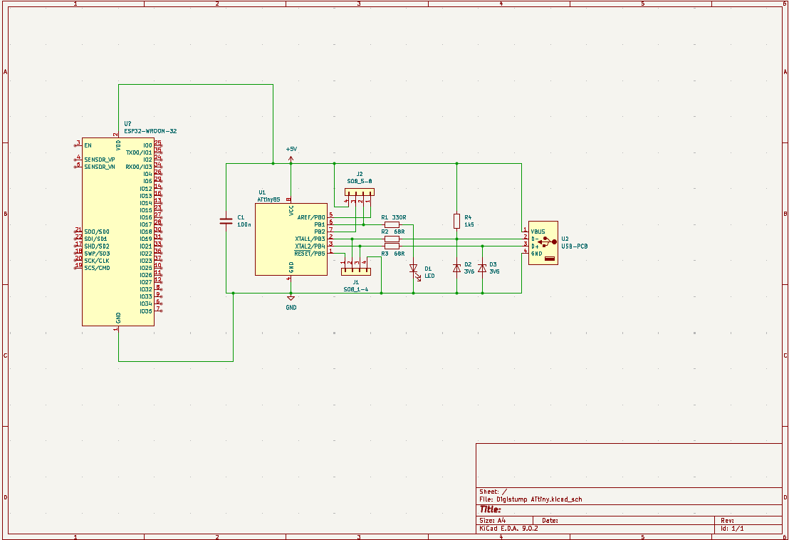
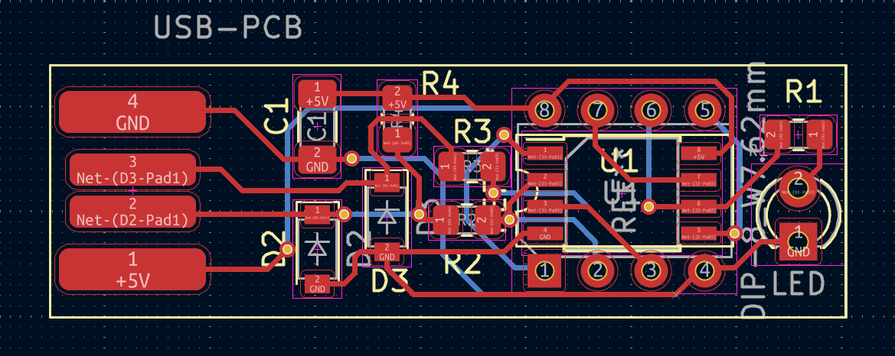
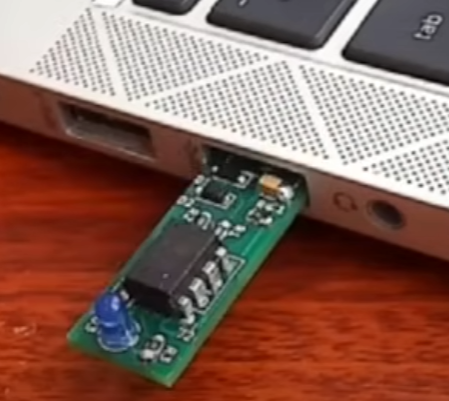

# Digistump ATtiny PCB Project

## Description

This project is a simple PCB design using the Digistump ATtiny microcontroller, developed as part of the Soldiers Hack Club. The board is intended for beginner-level electronics projects and uses KiCad 7 for design. It includes both manually routed and auto-routed layouts to compare routing methods.

## Bill of Materials (BoM)

| Item                      | Quantity |
|---------------------------|----------|
| Digispark ATtiny85 Module | 1        |
| USB Connector (Type-A)    | 1        |
| 10uF Capacitor            | 2        |
| 1kΩ Resistor              | 2        |
| LEDs                      | 2        |
| Male Header Pins          | 1 strip  |
| PCB Board                 | 1        |

## Screenshots

### Schematic

### PCB Layout

### 3D View

## Slack Verification
**Username**: Hassan Mohamed  
**Email**: hmmmma78@gmail.com
